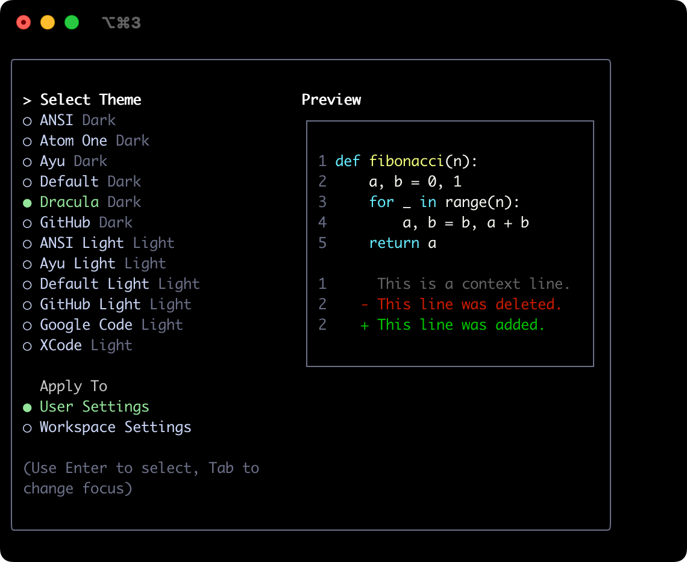
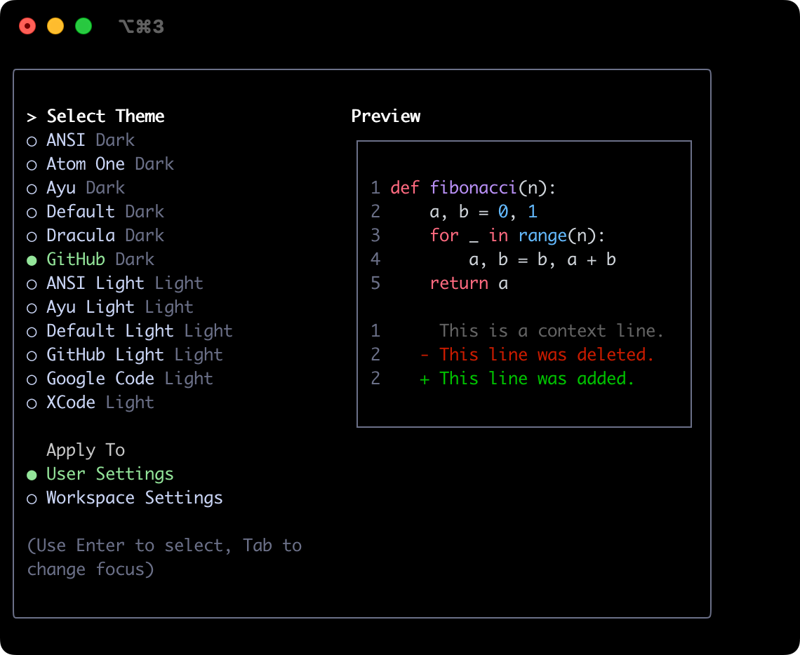
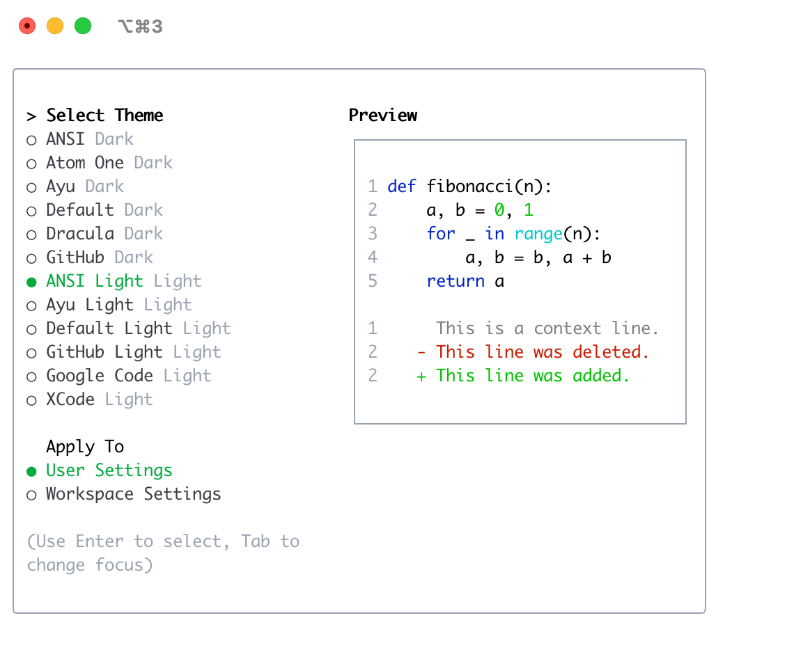
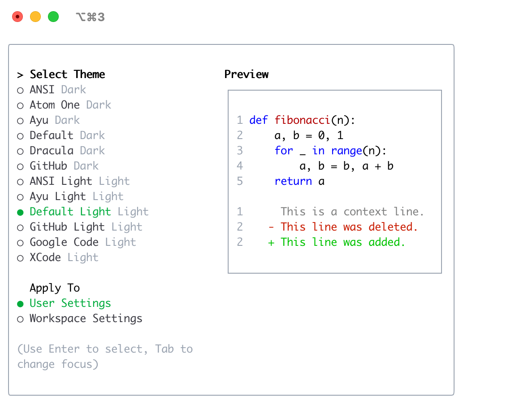

# テーマ

Gemini CLIは、さまざまなテーマをサポートしており、カラースキームや外観をカスタマイズできます。テーマは`/theme`コマンドまたは`"theme":`設定で変更できます。

## 利用可能なテーマ

Gemini CLIには、事前に定義されたテーマがいくつか用意されており、Gemini CLI内で`/theme`コマンドを使用して一覧表示できます。

- **ダークテーマ:**
  - `ANSI`
  - `Atom One`
  - `Ayu`
  - `Default`
  - `Dracula`
  - `GitHub`
- **ライトテーマ:**
  - `ANSI Light`
  - `Ayu Light`
  - `Default Light`
  - `GitHub Light`
  - `Google Code`
  - `Xcode`

### テーマの変更

1.  Gemini CLIに`/theme`と入力します。
2.  利用可能なテーマを一覧表示するダイアログまたは選択プロンプトが表示されます。
3.  矢印キーを使用してテーマを選択します。一部のインターフェイスでは、選択時にライブプレビューやハイライトが表示される場合があります。
4.  選択を確定してテーマを適用します。

### テーマの永続化

選択したテーマはGemini CLIの[設定](./docs/cli/configuration.md)に保存されるため、セッションをまたいで設定が記憶されます。

## ダークテーマ

### ANSI

### Atom OneDark

### Ayu

### Default

### Dracula

### GitHub

## ライトテーマ

### ANSI Light

### Ayu Light

### Default Light

### GitHub Light

### Google Code

### Xcode

 